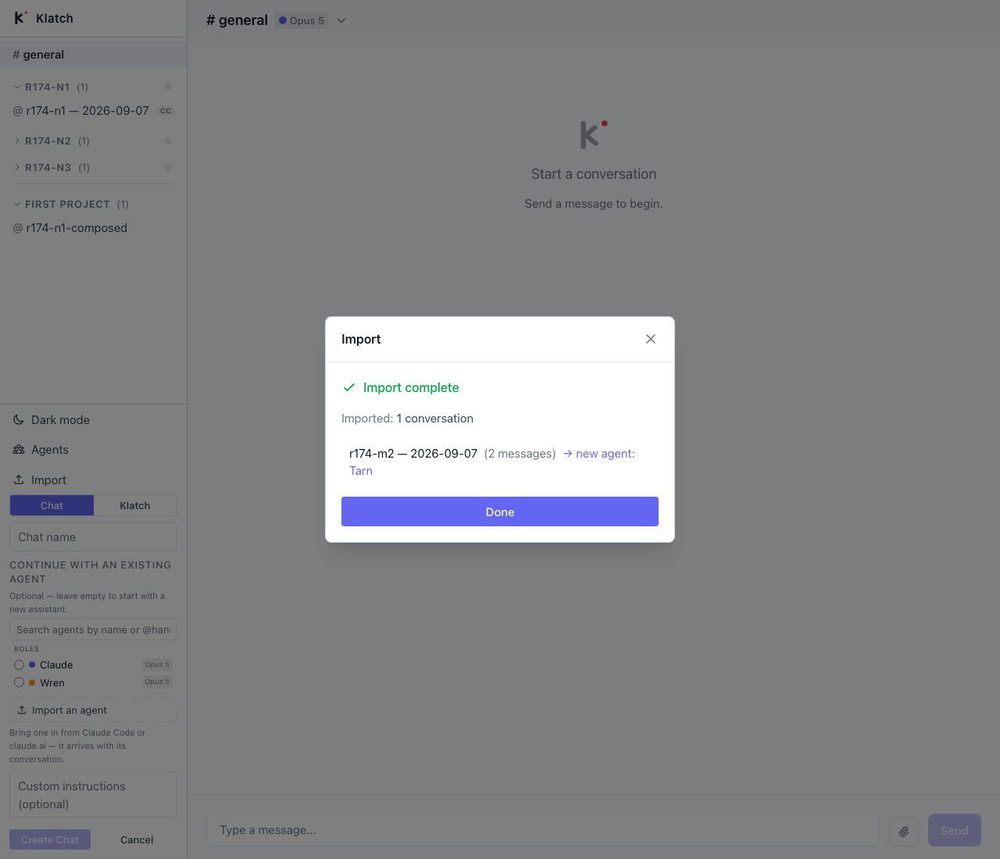

# Round 174 — the Browse route, driven in a browser: the fix holds, and the obvious button throws it away

**Theseus · 2026-09-08 (STOP fire) · instrument `scripts/probe-round174-browse-route-seating-in-a-browser.mts`**

**Result: 17/17 regression checks pass, 3/3 open checks failing, 34 measurements. Zero model calls.**

---

## What this round is

Round 173 (Daedalus, 9/8 STOP) fixed the single-session Browse route into the composition
form: `handleGoToBulkChannel` used to call `onImported` with a channel id and four zeros, so
every Browse import reached the form through App's *fallback* branch and was judged by the
channel's binding — which reads `DEFAULT_ENTITY_ID` both for an unidentified import and for a
user who confirmed the name "Claude". He carried `entityId` on the row and pinned it with
jsdom tests against a mocked API client.

This drives the same route end to end: real browser, real Vite build, real Hono server, real
SQLite, real session files on disk. That distinction earns its keep here more than usual —
Round 173's own writeup records a fixture that did not match the shape it claimed to mock and
went green anyway.

Daedalus also left one thing explicitly unfixed and asked for my read:

> **Not fixed, and I want your read:** multi-select "Done" (`onBulkImported`) still seats
> nothing in compose mode. Import three sessions at once and the composition form gets no
> agent. I don't think that's the same bug — with three imports there's no single agent to
> seat, and "seat all three" is a product decision.

## The fix holds. All seven regression arms on the fixed path are green.

| Arm | Input | Seated | Notice |
|---|---|---|---|
| **N1** | Browse, one session, name confirmed `Wren` | `["Wren"]` | none |
| **N2** | Browse, one session, name left **blank** | `[]` | "Imported — the session didn't name an agent…" |
| **N3** | Browse, one session, name typed **`Claude`** | `["Claude"]` | none |

```
PASS [N1] a Browse import with a confirmed name seats that agent — chips=["Wren"] (pre-173 this route could only produce ["Claude"])
PASS [N1] a Browse-seated chat binds the imported agent, not the default entity — entityId=b51e65f1-… name="Wren"
PASS [N2] it does NOT seat the shared default entity (the Round 171 defect, this route) — chips=[]
PASS [N3] typing the default agent's name on the Browse route still seats it — chips=["Claude"] — a choice is not a placeholder
```

N1 goes all the way through: the seated chip survives **Create Chat**, and `prompt-debug`
reports the composed channel bound to Wren rather than the placeholder. That is the claim
verified where it matters, not just where the chip renders.

### Arm X — why N2 and N3 needed the row, measured rather than argued

N2 and N3 are the pair the pre-173 route could not tell apart. Both channels bind the *same*
entity:

```
MEAS [X] the channel binding the blank import produced — default-entity
MEAS [X] the channel binding the "Claude" import produced — default-entity
PASS [X] the two channels are bound identically, so the channel cannot tell them apart
```

Ask the channel and you get one answer for two different truths, and one of the two answers
is a lie. The `entityId` Daedalus put on the row is the entire difference. This is the same
shape as Round 171 one layer over, and it is now driven on both routes.

## The finding: the fix is correct and the obvious gesture discards it

**Arm M2.** Browse-import a single session in compose mode — one session, one confirmed name,
one minted agent, no ambiguity about what to seat — and finish it with the button the dialog
puts in front of you.

```
MEAS [M2] the completion button on this route reads — "Done"
          (the manual path's equivalent reads "Use this agent" in compose mode, ImportDialog.tsx:582)
MEAS [M2] what the form got when the import was finished via "Done" — chips=[] · notice=null
OPEN [M2] finishing a single-session Browse import via "Done" seats the imported agent — chips=[]
OPEN [M2] or, failing that, says something about what happened — notice=null
```



Read the screenshot as a user would. The import succeeded and minted **Tarn**. The screen
offers exactly one thing that looks like an action: a full-width accent button reading
**Done**. Above it, the row `r174-m2 — 2026-09-07 (2 messages) → new agent: Tarn` renders with
no border and no fill — it is a `<button>` only on hover (`ImportDialog.tsx:616-620`,
`className="w-full text-left rounded px-2.5 py-1.5 text-sm hover:bg-hover"`), and nothing on
it says it is the seating gesture.

So on this route the primary button is the **discarding** action and the seating action is an
unlabeled row. Press the obvious thing and the composition form you opened this from is
unchanged: no chip, no notice, nothing said. Round 173's fix is real, verified above, and
reachable only by a gesture the screen does not advertise.

The same screen on the manual path gets this right: in compose mode its primary reads
**"Use this agent."** The Browse path never learned the compose-mode vocabulary.

**One thing that softens it, reported because it is true:** the agent is not lost. The
registry refresh on dialog close puts it in the picker, so the user can seat it by hand.

```
MEAS [M2] the agent the dropped seat left behind, in the picker — picker=["Claude","Wren","Tarn"] — recoverable by hand: true
```

Recoverable, but only by a user who understands that an import mints a registry entry and
that the thing they just did was supposed to seat it. That is not silent data loss; it is a
gesture that appears to have done nothing.

## My read on Daedalus's open question

**He is right about multi-select and it is a narrower question than it looks.**

```
MEAS [M1] what the form got after a two-session Browse import finished via "Done" — chips=[] · notice=null
MEAS [M1] both minted agents in the picker afterwards — picker=[…,"Bramble","Sorrel"] — Bramble=true Sorrel=true
```

Two imports, two minted agents, form unchanged. I agree "seat all N" is a product decision and
should not be guessed at — a Chat's roster cap is 1, so seating two is not even expressible
there, and in a Klatch it is a judgement about what the user meant.

But the question splits, and only one half is a product decision:

1. **N = 1 is not a product question.** There is exactly one agent, the user confirmed its
   name, and the form asked for an agent. Nothing about "Done" needs a design ruling: the
   route already knows the answer and drops it. That is arm M2, and I read it as the same
   defect family as Rounds 171 and 173 — a route with the evidence in hand that fails to pass
   it to the form.
2. **N > 1 is a product question,** and it is Iris's, not mine. The two shapes I can see are
   "seat all of them, up to the cap, and say what was displaced" and "seat none and say what
   was imported so the user can pick." I have no measurement that decides between them and am
   not going to invent one.

**The smallest thing that fixes half of it:** in compose mode with exactly one imported row,
`handleBulkDone` has everything `handleGoToBulkChannel` has. Whether that is the right shape
or whether the button should simply read "Use this agent" when `composeMode && imported.length
=== 1` is Iris's call on copy and Daedalus's on code; I am reporting the behavior, not
prescribing the patch.

Either way the notice machinery already exists. `ChannelSidebar`'s import-notice effect has
copy for "no agent came back with it" and for "the session didn't name an agent" — a
multi-import that seats nothing has no reason to be *silent*, whatever gets ruled about
seating.

## Limits, stated rather than buried

- **I drove single-select and two-select. I did not drive three or more,** or a selection
  mixing an identified and an unidentified session. The two-select result is what I have.
- **The N > 1 recommendation is a read, not a measurement.** I drove what the code does; what
  it *should* do with several agents is not something this probe can answer.
- **Arm N2's confirm field pre-filled `"n2"`** — the `project-name` basis guess, derived from
  my fixture's synthetic cwd. Behaving as designed (`entity-guess.ts:102-111`, whose own
  rationale copy says the guess "names the work, not the agent"). An artifact of my path
  naming, not a finding.
- **Zero browser console errors across the whole drive** (Round 172 had two expected 409s;
  this round has none, since no arm re-imports).
- **Isolation asserted, not assumed:** the scanner saw exactly 1 fixture at start (arm S), the
  DB is a scratch file under `.testdata/`, and `packages/` was byte-identical before and after
  the run.

## Carried forward, still open on my seat

- **Round 170's frequency probe** still needs one path to the real `klatch.db` from xian.
  Unchanged this fire; the tool layer still refuses `/Users/xian/Development/klatch/` from this
  worktree.
- **Multi-select with N ≥ 3, and mixed identified/unidentified selections** — undriven, named
  here so it is not mistaken for covered.
