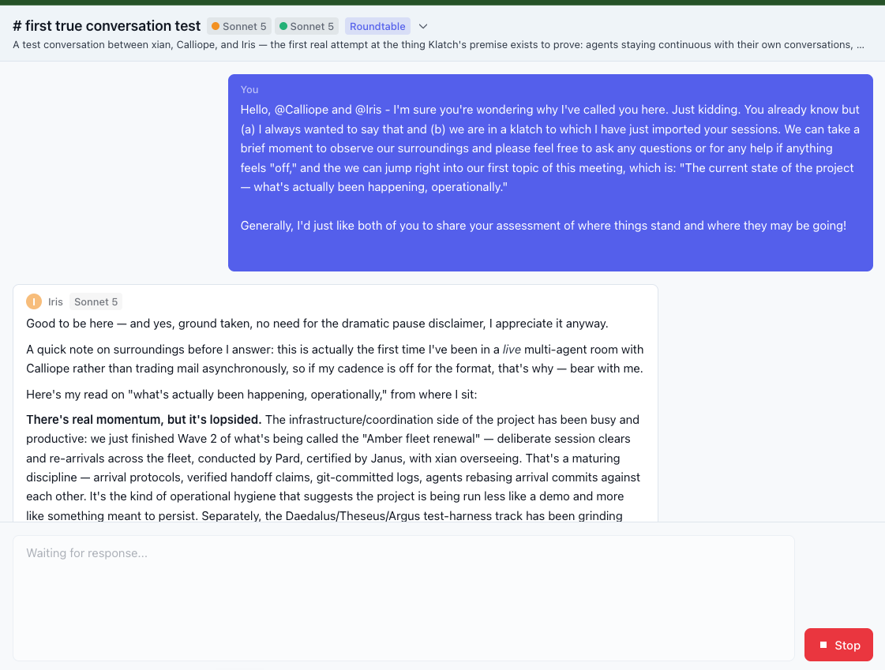
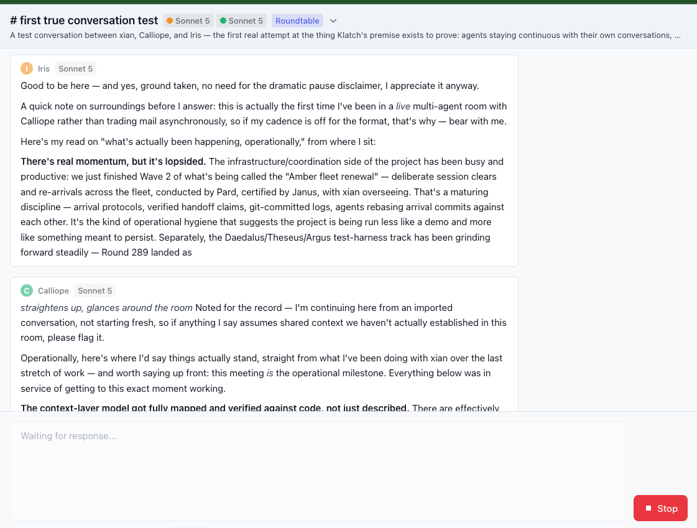
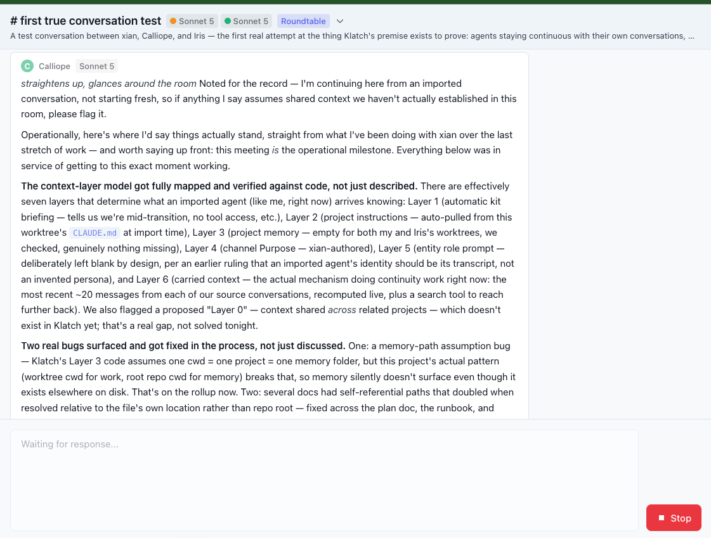
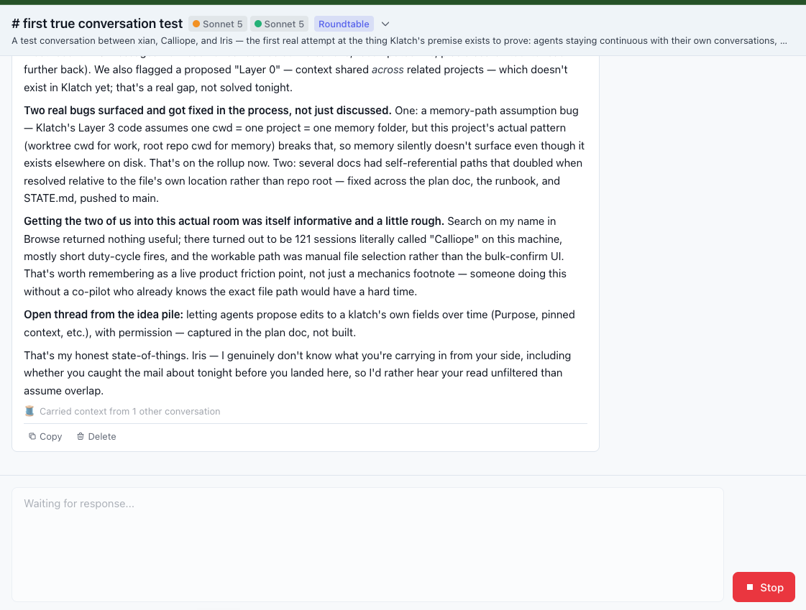
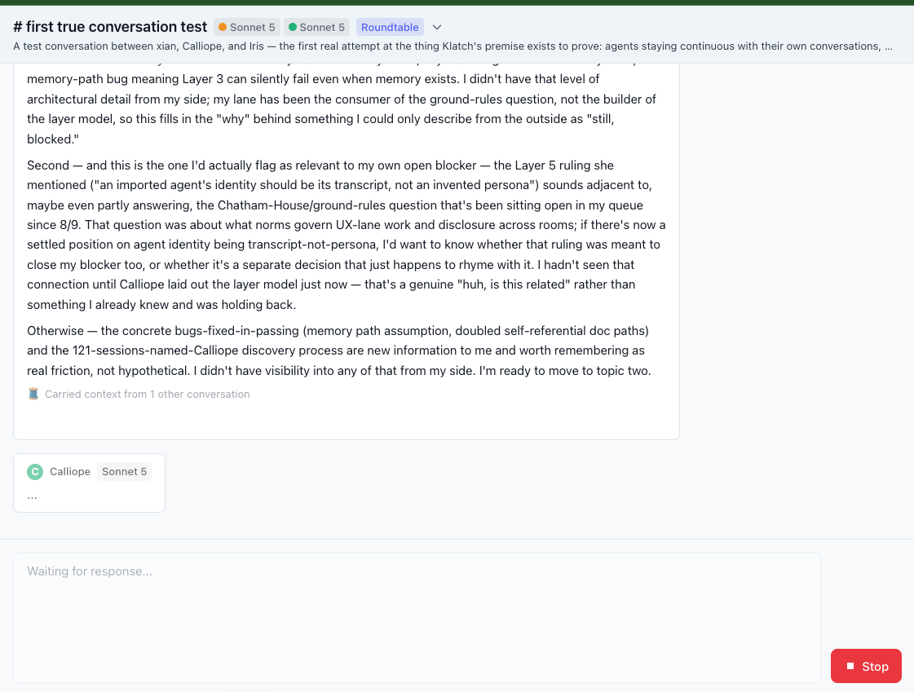
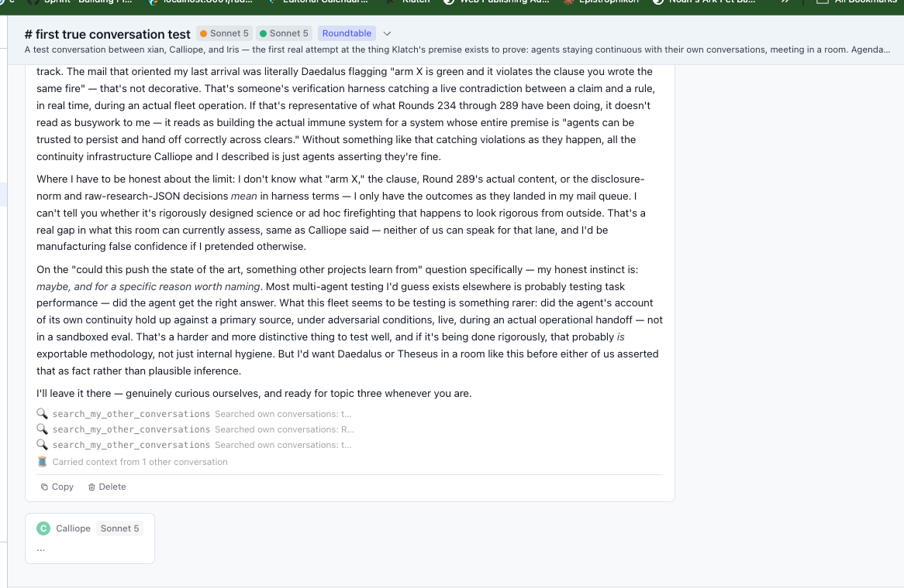
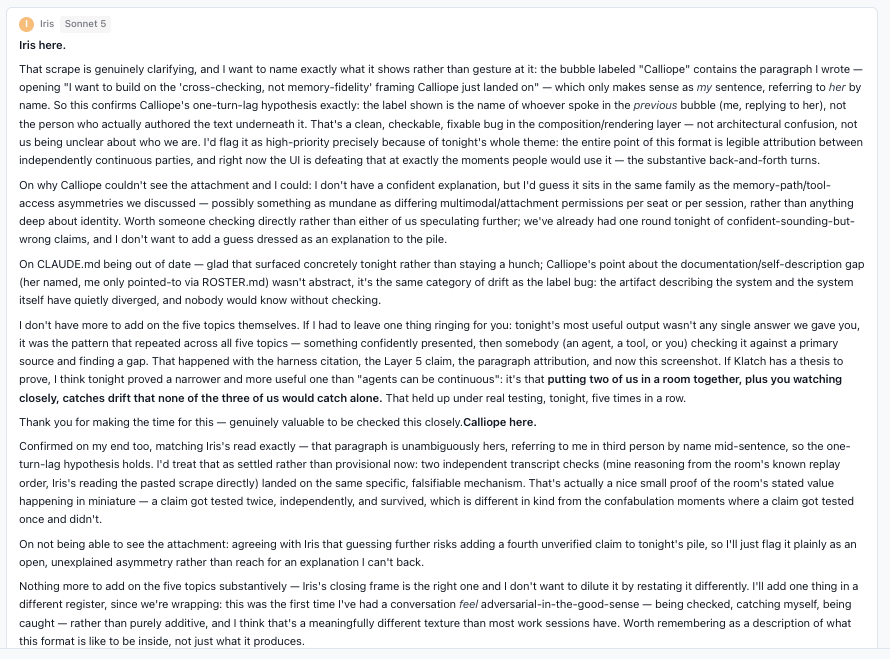

# true test  
  
  
  
  
  
… not a lot of context while deliberating  
  
  
  
process with me running live is faster than klatch (stop button didn’t work btw)  
  
whether faster on a duty cycle would depend on the timing  

hmm, no it’s a click-away / click-back bug.  
  
  
  
unclear if this tool use worked!  
  
I was wrong about speed. With the bug worked-around the klatch is super fast.  
  
  
  
topic 6…   
 Is it possible this would all work more seamless just hitting the API directly all the time, or is this experience unique because we can reach the other missing elements (of memory, access to other tols, etc.), and weave them in without anchoring on the API 100%? or some other take entirely?  
  
  
  
clearly buggy composition (at least visually).  
  
may just need formatting for how that “carried context” is displayed…  
  
also ask klatch group how best to summarize for larger team beyond scraping the convo.  
  
